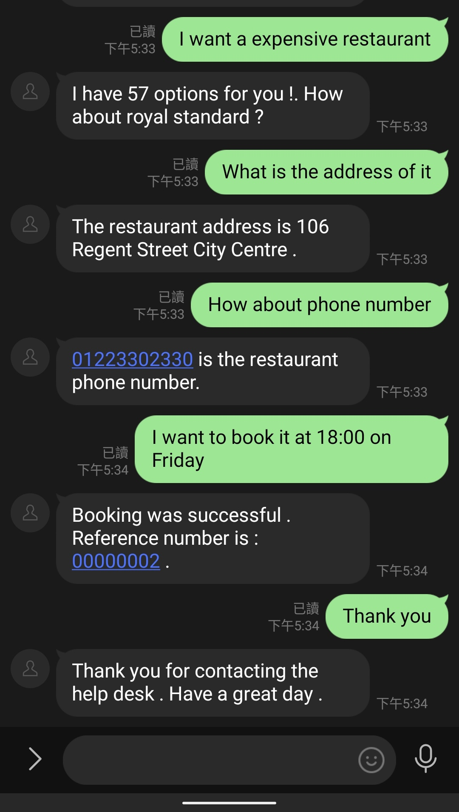

# Linebot demo

## 1. How to run

```bash
sudo docker run -itd -p ${port}:80 --rm --name demo --shm-size 32G --privileged --gpus all chin0880ee/cgi:line
```

## 2. How to access
Using Line app and scan QR code from [LINE Developers](https://developers.line.biz) Messaging API

### Demo




## 3. How to use
* Restaurant:
  * We can book the restaurant by offering the information about type of food and the price range.
  * After the system suggests the restaurant, we can ask for the address and phone number.
* Hotel:
  * We can book the hotel by offering the information about the price range and stars rated.
  * After the system suggests the hotel, we can ask for the address and phone number.
* Attraction:
  * We can find the attraction by offering the information about the area and attraction type.
  * After the system suggests the attraction, we can ask for the address and phone number.
