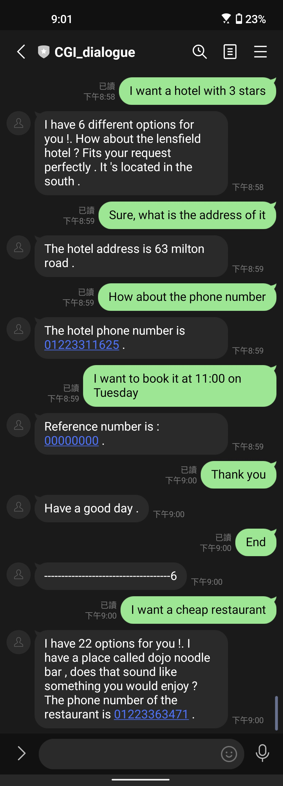

# Linebot demo

## 1. How to run

### Preparation
* You need to get CHANNEL_SECRET, CHANNEL_ACCESS_TOKEN and setup on [LINE Developers](https://developers.line.biz)
* You can refer to [linebot](https://mllab.asuscomm.com:12960/s/e5OzBzhDn)

```bash
sudo docker run -itd -p ${port}:80 -e port=${port} -e secret="<Channel secret>" -e access="<Channel access token>" --name demo --shm-size 32G --privileged --gpus all chin0880ee/cgi:line
```

## 2. How to access
Using Line app and scan QR code from [LINE Developers](https://developers.line.biz) Messaging API

### Demo



## 3. How to use
* Restaurant:
  * We can book the restaurant by offering the information about type of food and the price range.
  * After the system suggests the restaurant, we can ask for the address and phone number and book it.
* Hotel:
  * We can book the hotel by offering the information about the price range and stars rated.
  * After the system suggests the hotel, we can ask for the address and phone number and book it.
* Attraction:
  * We can find the attraction by offering the information about the area and attraction type.
  * After the system suggests the attraction, we can ask for the address and phone number and book it.
* You can enter "End" to reset the system
